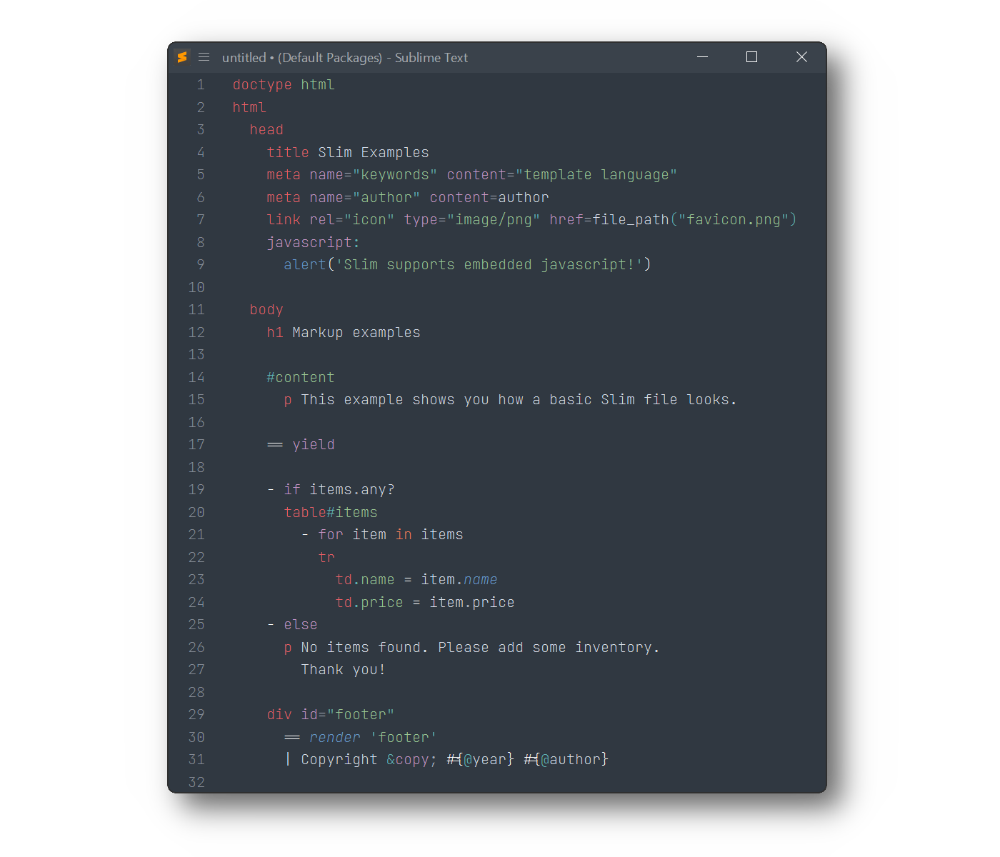

# Ruby Slim

Ruby [Slim Template Language](https://github.com/slim-template/slim) syntax definitions and snippets for [Sublime Text](https://www.sublimetext.com).



## Installation

### Package Control

The easiest way to install is using [Package Control](https://packagecontrol.io). It's listed as `Ruby Slim`.

1. Open `Command Palette` using <kbd>ctrl+shift+P</kbd> or menu item `Tools → Command Palette...`
2. Choose `Package Control: Install Package`
3. Find `Ruby Slim` and hit <kbd>Enter</kbd>

### Manual Install

You can clone this repository into your _Sublime Text/Packages_

> **Note**
>
> To find _Packages_ folder call _Menu > Preferences > Browse Packages..._

##### Mac OS

```shell
cd ~/Library/Application\ Support/Sublime\ Text/Packages/
git clone https://github.com/SublimeText/Slim.git "Ruby Slim"
```

##### Linux

```shell
cd ~/.config/sublime-text/Packages
git clone https://github.com/SublimeText/Slim.git "Ruby Slim"
```

##### Windows

```shell
cd "%APPDATA%\Sublime Text\Packages"
git clone https://github.com/SublimeText/Slim.git "Ruby Slim"
```

## Requirements

- Ruby Slim 2.0.0 requires Sublime Text 4107+
- Syntax highlighting in filters tags is powered by 3rd-party packages
  - [CoffeeScript](https://packagecontrol.io/packages/CoffeeScript)
  - [LESS](https://packagecontrol.io/packages/LESS)
  - [Sass/SCSS](https://packagecontrol.io/packages/Sass)

- Old TextMate compatible [ruby-slim.tmbundle](https://github.com/slim-template/ruby-slim.tmbundle) is installed on Sublime Text 2 and 3. It is however no longer actively maintained.